# CIMEB - Flowchart UX Completo

```mermaid
flowchart TD
    A[Usuário acessa CIMEB.com] --> B{Primeira visita?}
    
    %% Primeira visita
    B -->|Sim| C[Landing Page / Hero]
    C --> D[Navega pelo conteúdo]
    D --> E{Interesse em?}
    
    %% Jornadas diferentes
    E -->|Associação| F[Seção Sobre CIMEB]
    E -->|Cursos| G[Preview Academy]
    E -->|Produtos| H[Catálogo Loja/Livraria]
    E -->|Informações| I[Blog/Recursos]
    
    %% Fluxo de Associação
    F --> J{Quer se associar?}
    J -->|Sim| K[Clica ASSOCIE-SE]
    J -->|Não| L[Continua navegando]
    
    K --> M{Tem conta?}
    M -->|Não| N[Formulário Cadastro]
    M -->|Sim| O[Login]
    
    N --> P[Preenche dados pessoais]
    P --> Q[Confirmação email]
    Q --> R[Login automático]
    
    O --> S[Área logada]
    R --> S
    
    S --> T[Formulário Ministro]
    T --> U[Upload documentos]
    U --> V[Escolhe plano]
    V --> W[Gera PIX]
    W --> X{Pagamento confirmado?}
    
    X -->|Sim| Y[Associação ativa]
    X -->|Não| Z[Acompanha pagamento]
    Z --> X
    
    Y --> AA[Carteira digital gerada]
    AA --> AB[Acesso área exclusiva]
    
    %% Fluxo Academy
    G --> AC{Quer fazer curso?}
    AC -->|Sim| AD[Visualiza catálogo]
    AC -->|Não| L
    
    AD --> AE[Seleciona curso]
    AE --> AF{É gratuito?}
    
    AF -->|Sim| AG{Está logado?}
    AF -->|Não| AH[Adiciona ao carrinho]
    
    AG -->|Sim| AI[Inscreve automaticamente]
    AG -->|Não| AJ[Precisa fazer login]
    AJ --> M
    
    AH --> AK[Vai para checkout]
    AK --> AL{Está logado?}
    AL -->|Não| M
    AL -->|Sim| AM[Processo pagamento]
    
    AM --> AN{Pagamento ok?}
    AN -->|Sim| AI
    AN -->|Não| AO[Retry pagamento]
    AO --> AM
    
    AI --> AP[Acessa player]
    AP --> AQ[Assiste aulas]
    AQ --> AR[Marca progresso]
    AR --> AS{Concluiu curso?}
    
    AS -->|Sim| AT[Gera certificado]
    AS -->|Não| AU[Continua estudando]
    AU --> AP
    
    AT --> AV[Download certificado]
    AV --> AW[Adiciona ao perfil]
    
    %% Fluxo E-commerce
    H --> BA[Navega produtos]
    BA --> BB[Aplica filtros]
    BB --> BC[Seleciona produto]
    BC --> BD[Visualiza detalhes]
    BD --> BE{Quer comprar?}
    
    BE -->|Sim| BF[Adiciona carrinho]
    BE -->|Não| BG[Continua navegando]
    BG --> BA
    
    BF --> BH{Continua comprando?}
    BH -->|Sim| BG
    BH -->|Não| BI[Vai para carrinho]
    
    BI --> BJ[Revisa itens]
    BJ --> BK{Modifica carrinho?}
    BK -->|Sim| BL[Atualiza quantidades]
    BK -->|Não| BM[Vai para checkout]
    
    BL --> BJ
    BM --> BN{Está logado?}
    BN -->|Não| M
    BN -->|Sim| BO[Preenche endereço]
    
    BO --> BP[Escolhe frete]
    BP --> BQ[Confirma pedido]
    BQ --> BR[Gera PIX]
    BR --> BS{Pagamento confirmado?}
    
    BS -->|Sim| BT[Pedido confirmado]
    BS -->|Não| BU[Aguarda pagamento]
    BU --> BS
    
    BT --> BV{Produto digital?}
    BV -->|Sim| BW[Download imediato]
    BV -->|Não| BX[Envia para separação]
    
    BW --> BY[Adiciona à biblioteca]
    BX --> BZ[Tracking de envio]
    BZ --> CA[Produto entregue]
    
    %% Usuário retornando
    B -->|Não| CB{Está logado?}
    CB -->|Sim| CD[Dashboard pessoal]
    CB -->|Não| CE[Página inicial]
    CE --> D
    
    %% Dashboard
    CD --> CF[Visualiza resumo]
    CF --> CG{O que quer fazer?}
    
    CG -->|Ver cursos| CH[Meus cursos]
    CG -->|Ver pedidos| CI[Histórico pedidos]
    CG -->|Ver dados| CJ[Editar perfil]
    CG -->|Ver associação| CK[Status ministério]
    CG -->|Sair| CL[Logout]
    
    CH --> AP
    CI --> CM[Detalhes pedido]
    CJ --> CN[Edita informações]
    CN --> CO[Salva alterações]
    CO --> CF
    
    CK --> CP{Associação ativa?}
    CP -->|Sim| CQ[Baixa carteira]
    CP -->|Não| CR[Renova associação]
    CR --> V
    
    %% Mobile/Responsivo
    D --> CS{Dispositivo mobile?}
    CS -->|Sim| CT[Menu hambúrguer]
    CS -->|Não| CU[Menu horizontal]
    
    CT --> CV[Menu lateral]
    CV --> CW[Navegação touch]
    CU --> CX[Navegação desktop]
    
    %% WhatsApp Integration
    D --> CY[Widget WhatsApp]
    CY --> CZ{Clica WhatsApp?}
    CZ -->|Sim| DA[Abre chat]
    DA --> DB[Mensagem pré-definida]
    DB --> DC[Conversa com suporte]
    
    %% Newsletter
    D --> DD[Banner newsletter]
    DD --> DE{Quer se inscrever?}
    DE -->|Sim| DF[Insere email]
    DF --> DG[Confirma inscrição]
    DG --> DH[Recebe email confirmação]
    DH --> DI[Newsletter ativa]
    
    %% Radio
    D --> DJ[Seção Rádio CIMEB]
    DJ --> DK{Quer ouvir?}
    DK -->|Sim| DL[Inicia player]
    DL --> DM[Stream ao vivo]
    DM --> DN[Controles player]
    
    %% Search
    D --> DO[Barra de busca]
    DO --> DP[Digite termo]
    DP --> DQ[Resultados]
    DQ --> DR[Filtra por categoria]
    DR --> DS[Seleciona resultado]
    DS --> BC
    
    %% Error Handling
    X --> DT{Erro no pagamento?}
    DT -->|Sim| DU[Mensagem erro]
    DU --> DV[Opções alternativas]
    DV --> W
    
    AN --> DW{Erro no pagamento?}
    DW -->|Sim| DX[Mensagem erro]
    DX --> DY[Retry ou suporte]
    DY --> AM
    
    %% Admin Flow (Futuro)
    M --> DZ{É admin?}
    DZ -->|Sim| EA[Painel admin]
    EA --> EB[Gestão usuários]
    EA --> EC[Gestão produtos]
    EA --> ED[Relatórios]
    EA --> EE[Configurações]
    
    %% PWA/Offline
    A --> EF{Conexão disponível?}
    EF -->|Não| EG[Modo offline]
    EG --> EH[Cache local]
    EH --> EI[Funcionalidades limitadas]
    EI --> EJ[Sincroniza quando online]
    
    %% Accessibility
    D --> EK{Usuário com deficiência?}
    EK -->|Sim| EL[Screen reader]
    EL --> EM[Navegação por teclado]
    EM --> EN[Alto contraste]
    EN --> EO[Texto ampliado]
    
    %% Analytics
    A --> EP[Track página inicial]
    D --> EQ[Track interações]
    K --> ER[Track conversão]
    BF --> ES[Track add to cart]
    BT --> ET[Track purchase]
    
    style A fill:#1e40af,color:#fff
    style Y fill:#22c55e,color:#fff
    style AT fill:#22c55e,color:#fff
    style BT fill:#22c55e,color:#fff
    style DU fill:#ef4444,color:#fff
    style DX fill:#ef4444,color:#fff
```

## Legenda dos Estados

### 🟦 Estados Iniciais
- **A**: Ponto de entrada principal
- **C**: Landing page otimizada para conversão
- **D**: Navegação explorativa

### 🟢 Estados de Sucesso
- **Y**: Associação ativa e funcionando
- **AT**: Curso concluído com certificado
- **BT**: Compra realizada com sucesso

### 🔴 Estados de Erro
- **DU/DX**: Falhas de pagamento com recovery
- **EG**: Modo offline com funcionalidades limitadas

### 🔄 Estados de Processo
- **X/BS**: Aguardando confirmação de pagamento
- **U**: Upload de documentos em andamento
- **AR**: Progresso do curso sendo trackeado

## Considerações UX

### Jornada do Ministro
1. **Descoberta**: Landing page clara sobre benefícios
2. **Interesse**: Informações detalhadas sobre associação
3. **Conversão**: Processo simplificado de cadastro
4. **Ativação**: Confirmação rápida e carteira digital
5. **Retenção**: Área exclusiva com valor contínuo

### Jornada do Estudante
1. **Exploração**: Catálogo atrativo de cursos
2. **Avaliação**: Preview e informações detalhadas
3. **Compra**: Checkout otimizado
4. **Consumo**: Player intuitivo e responsivo
5. **Certificação**: Reconhecimento do aprendizado

### Jornada do Comprador
1. **Descoberta**: Produtos relevantes e bem categorizados
2. **Comparação**: Filtros e busca eficientes
3. **Decisão**: Informações claras e reviews
4. **Compra**: Processo rápido e seguro
5. **Entrega**: Tracking e satisfação pós-venda

### Pontos Críticos de Conversão
- **Call-to-Actions**: Botões claros e destacados
- **Formulários**: Campos mínimos necessários
- **Pagamentos**: PIX como método principal (brasileiro)
- **Confiança**: Certificados de segurança visíveis
- **Social Proof**: Depoimentos e números de associados

### Experiência Mobile
- **Touch First**: Botões e elementos otimizados para touch
- **Navigation**: Menu hambúrguer intuitivo
- **Performance**: Carregamento rápido mesmo em 3G
- **Offline**: Funcionalidades básicas disponíveis offline
